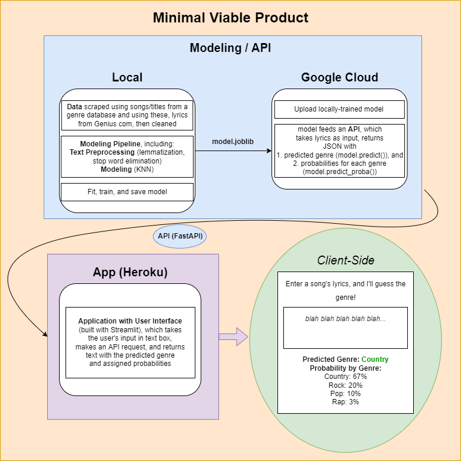

# GenreGuesser: Guessing a Song's Genre from its Lyrics

**Team (alphabetical by last name):**
* [Marc Dunker](https://github.com/Dunkerm)
* [Rob Pasternak](https://github.com/robpasternak) (project lead)
* [Jules Pastor](https://github.com/JJPPastor)
* [Julia Welchering](https://github.com/julia-welch)

## Overview

- Different genres of music have differing tendencies with respect to their lyrical content.
    * Stereotypes: country songs are about trucks, freedom, and America, while pop songs are about romance, etc.
- **GenreGuesser** is a machine-learning classification algorithm trained on the lyrics of thousands of songs, which takes a string of lyrics and returns a predicted genre (along with probabilities for each genre in its domain of possibilities).
- The model will be trained locally but hosted on the cloud, with an API that will be accessed by a user-friendly app hosted on Heroku.



## Description (Current State)

### Front End

- Hosted on Heroku, developed on Streamlit
- Textbox requesting a single song's lyrics; upon entering the lyrics the app will show:
    1. The predicted genre
    2. The probabilities assigned to each genre of those the model is trained on

### Back End

- Modelling pipeline trained locally:
    * Data scraped from [Genius.com](https://www.genius.com), using song metadata scraped from [Dave Tompkins's Music Database](https://cs.uwaterloo.ca/~dtompkin/music/) and the [Billboard](https://www.billboard.com/charts/hot-100/).
    * Initial genres: **Country**, **Folk**, **Jazz**, **Pop**, **Rap**, **Rock**
    * Data cleaned and vectorized for a bag-of-words model using term frequency-inverse document frequency (TF-IDF)
    * Result is fed to a *k-nearest neighbors* model (current settings: 5 neighbors, weighted by distance)
- Model uploaded to Google Cloud Platform (GCP), where it is used to serve an API that makes predictions for new data
- API is accessed by front end to deliver user-friendly results

### Brief Descriptions of Existing Modules

The current modules are described below. Italicized modules will eventually be deleted.

* `GenreGuesser/...`
    * `data_cleaning.py`: code for preliminary cleaning of data (removing duplicates, remixes, blank songs, etc.)
    * _`dummy_trainer.py`_: code for uploading a barebones model, used for refining other code before modeling could take place
    * `gcp.py`: code for uploading model(s) to GCP
    * `model_select.py`: code for different ways of testing models (k-fold cross-validation, 70-30 split, grid search)
    * `params.py`: text parameters to be loaded by other modules (e.g., names of GCP buckets)
    * `pipeline.py`: code for the _k_-neighbors machine learning pipeline
    * `scrappy.py`: code for web scraping of lyrics
    * `svm_pipe.py`: code for the support vector machine (SVM) machine learning pipeline
    * `text_prepoc`: code for within-pipeline text preprocessing (e.g. lemmatization)
    * `training.py`: unifying code that trains a model and (eventually) uploads it to GCP
* `api/...`
    * `fast.py`: code for serving an API on GCP which will return both a genre prediction and probabilities assigned to each genre

## Future Plans
### Finishing the Minimal Viable Product (MVP)

1. Finish obtaining the scraped data
2. Test and train the base model locally
    * Code for testing and training model is finished, just need data
3. Move base model to Google Cloud
4. Finish code to create the API, start it up
5. Develop front end and push to Heroku

### Potential Extensions to the MVP

* Accumulating more data for training
* Decisions about what genres to include/exclude
* Improving upon the model
    * Finetune parameters using grid search (code already in place) or random search
    * Try different classifiers for bag-of-words
        * support vector machine
        * naive Bayes
        * decision tree
        * ensemble methods
        * etc.
    * Transitioning to deep learning models (requires more data)
        * recurrent neural networks (including LSTM and GRU)
        * convolutional neural networks
    * Potentially intresting but beyond the scope of the project: using transformers (BERT, RoBERTa)
* Switching to cloud-based training over local (especially useful for more complex deep learning models)
* Improving the app, possibly by switching from Streamlit to a more customizable format


## Instructions

### How to Add a New Pipeline

To add a new pipeline, you'll need to come up with a `SHORTNAME` and a `LONGNAME`, both strings. The choice of `LONGNAME` doesn't really matter, since it just affects what the command line will say when it updates you on the progress of, say, model saving (e.g., ``KNeighbors``). The choice of ``SHORTNAME`` **DOES** matter, as it determines the name of the `.joblib` file and various other stuff, so choose that wisely. I recommend a short, all-lower-case name: for the KNeighbors model we've used `knn`, for SVM we've used `'svm'`, etc. From now on I use `SHORTNAME` to indicate the short name **WITHOUT** quotation marks, and `'SHORTNAME'` for the name **WITH** quotation marks (likewise for `LONGNAME`).

With this in mind, let's proceed!

1. Within the `GenreGuesser` directory, copy the `pipeline.py` file as `SHORTNAME_pipeline.py`.
2. If it's there, make sure to delete any mentions of the function `save_model`, since that function doesn't work and will cause an error. This includes any import statement (`from GenreGuesser.gcp import save_model`) and the `if __name__ == "main"` bit (if it's there), both of which are not necessary.
2. Change the name of the function `get_knn_pipe()` to `get_SHORTNAME_pipe()`, and modify the function so that it returns the type of pipeline you'd like to work with. (Make sure to include sklearn/tflow imports for your models!)
4. Open `training.py`.
5. Add the following line to the import statement: `from GenreGuesser.SHORTNAME_pipeline import get_SHORTNAME_pipe`
6. Add the following line to the dictionary `MODEL_DICT` (with the comma, since that'll make adding further lines easier):
```
'SHORTNAME' : (get_SHORTNAME_pipe(), 'LONGNAME'),
```
7. Switch to the `Makefile`
8. Add the following lines to the `Makefile`, making sure the indent is an actual indent and not just a sequence of spaces:
```
fit_SHORTNAME:
	@python -m ${PACKAGE_NAME}.${FILENAME} localfit SHORTNAME
```
and
```
cv_SHORTNAME:
	@python -m ${PACKAGE_NAME}.${FILENAME} cross_val SHORTNAME
```
and
```
one_split_SHORTNAME:
	@python -m ${PACKAGE_NAME}.${FILENAME} one_split SHORTNAME
```

And you're done! Now if you want to fit your model, just go to the main folder (with the `Makefile` in it) and put in the command `make fit_SHORTNAME`. This will fit your model on the data in whatever csv file is specified by the `DATA_SOURCE` variable in `params.py`, so make sure to set this correctly before doing any fitting and/or testing. Your model will then be saved (**locally**) as `SHORTNAME.joblib`, and can be uploaded to GitHub in the usual way. If you want to do a five-fold cross-validation of your pipeline, try `make cv_SHORTNAME`. You can also do a single 70-30 split test with `make one_split_SHORTNAME`.

GridSearch/RandomSearch is a bit more complicated, since defining a grid search for a given model requires knowing what hyperparameters you want to play with and how you want to try them. Some possibilities include (1) just doing it manually in a Jupyter notebook (or simply IPython in your terminal) by importing your pipeline and the relevant modules, files, etc; or (2) modifying the grid search code in `model_select.py`, as well as adding a `Makefile` command of the form `grid_SHORTNAME`. I (Rob) have done this for the KNN model, since that's what I've been finetuning; hopefully there's enough there that one should be able to modify it for different pipelines with different hyperparameters. I'm of course available for questions.
